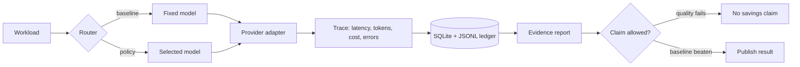

# Cost-Optimized Inference


A small LLM inference gateway for proving whether a routing policy actually improves
cost, latency, or quality.

The project is intentionally narrow: send real provider requests, capture usage,
route with explainable policies, and export evidence that can be reproduced.



## Why This Exists

Most LLM routing demos make the answer look obvious: cheaper model, lower cost,
same quality. That is usually not proven.

This repo treats routing as an experiment. Every optimization needs:

- a baseline;
- real provider usage;
- latency and retry behavior;
- cost accounting from pricing data;
- quality checks good enough to reject bad savings.

## Implemented

| Area | Current state |
| --- | --- |
| Provider path | OpenAI-compatible live calls with timeout, retry, cancellation, and normalized errors |
| Models | FreeModel pricing entries for `gpt-5.5`, `gpt-5.4`, `gpt-5.4-mini`, `gpt-5.3-codex` |
| API | FastAPI `/v1/inference` backed by the real provider adapter |
| Routing | `single_model`, `rule_based`, and policy routing with reason codes |
| Evidence | JSONL request ledger, SQLite benchmark ledger, JSON/Markdown exports |
| Gates | `ruff`, `mypy`, `pytest`, plus credential-gated provider integration test |

## Not Claimed

- Production readiness.
- Cost savings without a committed benchmark report.
- Semantic quality parity across broad tasks.
- Large-scale infrastructure that has not been justified by local evidence.

## Quick Start

```bash
python3 -m venv .venv
.venv/bin/python -m pip install -e ".[dev,providers]"
make check
```

For live calls, create `.env` locally:

```bash
OPENAI_BASE_URL=https://api.freemodel.dev/v1
OPENAI_API_KEY=your_key_here
OPENAI_TEST_MODEL=gpt-5.4-mini
```

`.env` is ignored by git.

## Run A Real Smoke Call

```bash
set -a; source .env; set +a

.venv/bin/python -m inference_engine.cli \
  --provider openai \
  --model gpt-5.4-mini \
  --prompt "Reply with exactly: ok" \
  --max-tokens 8 \
  --temperature 0
```

## Run A Benchmark

```bash
set -a; source .env; set +a

.venv/bin/python scripts/run_benchmark.py run \
  --workload benchmarks/workloads/smoke.jsonl \
  --strategy single_model \
  --model gpt-5.4-mini \
  --max-estimated-cost-usd 0.01 \
  --run-id baseline-gpt-5-4-mini

.venv/bin/python scripts/run_benchmark.py export \
  --run-id baseline-gpt-5-4-mini \
  --format both
```

## Current Evidence

Live FreeModel validation has confirmed provider connectivity, returned usage
metadata, pricing-based cost calculation, and the credential-gated integration test.

The current smoke workload completed 3/3 provider calls, but only 1/3 quality checks
passed. That is a useful result: it blocks any honest savings claim until the eval
set is improved.

## Next Engineering Tasks

1. Replace the weak smoke workload with deterministic, fair tasks.
2. Commit reviewed benchmark artifacts with explicit limitations.
3. Add deadline-aware fallback behavior to the router.
4. Feed observed latency profiles back into routing decisions.
5. Expand quality evaluation beyond exact deterministic checks.

## Docs

- [Project Status](./PROJECT_STATUS.md)
- [Strategy Brief](./docs/00_STRATEGY_BRIEF.md)
- [Target Architecture](./docs/01_TARGET_ARCHITECTURE.md)
- [Implementation Roadmap](./docs/02_IMPLEMENTATION_ROADMAP.md)
- [Benchmark And Eval Plan](./docs/03_BENCHMARK_AND_EVAL_PLAN.md)
- [Codex Quality System](./docs/04_CODEX_QUALITY_SYSTEM.md)
