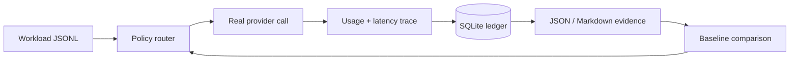
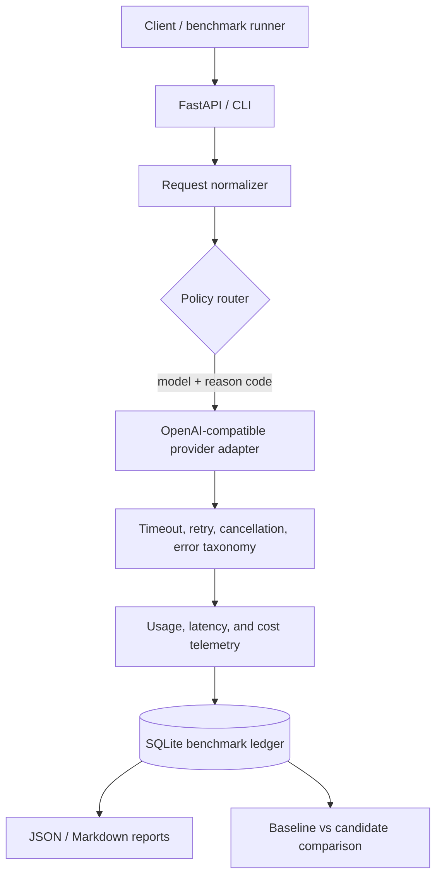
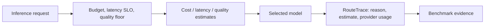

# Honest LLM Inference Gateway


An evidence-first LLM inference gateway and benchmark lab for measuring real cost,
latency, and quality tradeoffs in model routing.

This is intentionally not a fake production platform. The project focuses on one
narrow workflow: execute real provider calls, record usage, route by policy, compare
against a baseline, and export reproducible evidence.



## What It Solves

LLM routing claims are easy to fake. This repo is built to answer practical questions
with measured data:

- Which model handled each request, and why?
- Did routing reduce cost without breaking quality checks?
- What did the provider actually report for tokens, latency, retries, and cost?
- Can a benchmark run be reproduced from a command and exported artifact?

## Current Capabilities

- OpenAI-compatible provider execution with timeout, bounded retries, cancellation,
  normalized provider errors, and usage-based cost accounting.
- FreeModel-compatible pricing entries for confirmed models:
  `gpt-5.5`, `gpt-5.4`, `gpt-5.4-mini`, `gpt-5.3-codex`.
- FastAPI `/v1/inference` route backed by the same real provider adapter.
- JSONL request ledger and SQLite benchmark ledger.
- Queryable provider usage summaries by run.
- Deterministic baseline routing: `single_model`, `rule_based`.
- Deterministic policy routing with cost budget, latency SLO, quality floor, and
  auditable reason codes.
- Benchmark export to JSON and Markdown, including route decisions, provider usage,
  token/cost breakdowns, latency profiles, and limitations.
- Strict local gates: `ruff`, `mypy`, `pytest`.

## Current Surface

| Surface | State | Evidence Boundary |
| --- | --- | --- |
| Provider calls | Real | OpenAI-compatible adapter plus gated live-provider integration test |
| Cost accounting | Usage-based | Provider token metadata mapped through versioned pricing |
| Routing | Deterministic | Strategy output includes selected model, estimate, and reason code |
| Persistence | Local and inspectable | JSONL request ledger plus SQLite benchmark tables |
| Benchmark claims | Conservative | No savings claim until workload quality and baseline artifacts are committed |

## What Is Not Claimed

- No production-readiness claim.
- No savings claim without committed benchmark evidence.
- No fake dashboards, synthetic savings, or placeholder provider integrations.
- No broad semantic quality evaluation yet.
- No large-scale infrastructure such as Kubernetes, service mesh, or distributed queues.

## Quick Start

```bash
python3 -m venv .venv
.venv/bin/python -m pip install -e ".[dev,providers]"
```

Run local gates:

```bash
make check
```

For real provider calls, create a local `.env` file:

```bash
OPENAI_BASE_URL=https://api.freemodel.dev/v1
OPENAI_API_KEY=your_key_here
OPENAI_TEST_MODEL=gpt-5.4-mini
```

`.env` is ignored by git.

## Real Provider Smoke

```bash
set -a; source .env; set +a

.venv/bin/python -m inference_engine.cli \
  --provider openai \
  --model gpt-5.4-mini \
  --prompt "Reply with exactly: ok" \
  --max-tokens 8 \
  --temperature 0
```

Run the gated real-provider integration test:

```bash
set -a; source .env; set +a
.venv/bin/python -m pytest tests/integration/test_real_provider.py -q
```

Without credentials, this test is skipped.

## Benchmark Flow

Run a baseline:

```bash
set -a; source .env; set +a

.venv/bin/python scripts/run_benchmark.py run \
  --workload benchmarks/workloads/smoke.jsonl \
  --strategy single_model \
  --model gpt-5.4-mini \
  --max-estimated-cost-usd 0.01 \
  --run-id baseline-gpt-5-4-mini
```

Export evidence:

```bash
.venv/bin/python scripts/run_benchmark.py export \
  --run-id baseline-gpt-5-4-mini \
  --format both
```

Summarize stored provider usage:

```bash
.venv/bin/python scripts/run_benchmark.py usage-summary \
  --run-id baseline-gpt-5-4-mini
```

## Current Evidence

Recent local validation with FreeModel `gpt-5.4-mini`:

- provider smoke call succeeded;
- usage metadata was returned;
- cost was calculated from the versioned pricing table;
- gated real-provider integration test passed with credentials;
- normal test suite remains credential-safe by skipping the real-provider test.

A one-off benchmark run completed 3/3 provider calls with zero retries, but the
deterministic smoke workload only passed quality checks on 1/3 tasks. That means the
next meaningful work is improving workload/eval validity before publishing any cost
or routing claim.

## Architecture



## Routing Decision Shape



The default stack stays small: FastAPI, provider SDKs, SQLite, pytest, ruff, and mypy.

## Next Work

1. Tighten the smoke workload so quality checks are deterministic and fair.
2. Commit reviewed real benchmark artifacts with limitations.
3. Add deadline-aware fallback constraints to policy routing.
4. Feed observed latency profiles back into routing decisions.
5. Add broader eval coverage beyond simple deterministic validators.

## Documentation

- [Project Status](./PROJECT_STATUS.md)
- [Strategy Brief](./docs/00_STRATEGY_BRIEF.md)
- [Target Architecture](./docs/01_TARGET_ARCHITECTURE.md)
- [Implementation Roadmap](./docs/02_IMPLEMENTATION_ROADMAP.md)
- [Benchmark And Eval Plan](./docs/03_BENCHMARK_AND_EVAL_PLAN.md)
- [Codex Quality System](./docs/04_CODEX_QUALITY_SYSTEM.md)

## Principle

Small, real, measurable infrastructure beats a large scaffold with fake claims.
